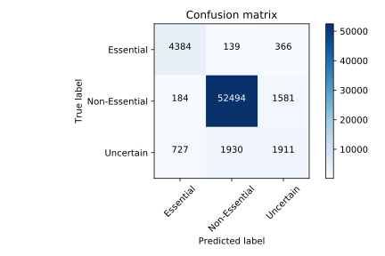

# PopulationStructure
Using population structure data to predict gene essentialty and adaptive outcome

### Aim 1: Is population structure predictive of the essentiality of genes? 
#### Aim 1a: Generate phylogenetic trees of S. pneumoniae 
Using snippy and RAxML, core genome SNPs were identified and used as input to generate maximum-likelihood trees for 2 datasets: PG350 (Nijmegen dataset) and  PGall (~200 strains from multiple sources across the world).       
A second tree was generated, removing predicted recombination events with gubbins. 
#### Aim 1b: Test whether genetic distance is associated with essentialome overlap.  
Spearman rank correlations (since the distributions are unbalanced bimodal) between SNP distance and Essentialome overlap: 0.505    
•	A strain selection strategy that includes more pairs with intermediate distance (not as close as the current pairs, but not as distant as random selections) would add more confidence to whether or not there is a real relationship between genetic distance and essentialome distance. 

#### Aim 1c: Train and evaluate a model that use genetic distance to predict essentiality of individual genes in a given strain. 
Developed a simple predictor of essentiality (no model training required):
•	Input: gene X in strain Y. Output: is X essential in Y?     
•	Algorithm: let Y’ be the strain with the smallest SNP distance to Y.     
Let X’ be the homolog of X in the Y’ genome     
If X’ is essential, predict X to be essential. If X’ is uncertain, predict X to be uncertain. If X’ is absent or nonessential, predict X’ to be nonessential.     
    
    
#### Aim 1c (ii) Literature Search	
For genes whose essentiality can be predicted with the presence/absence of 1 or 2 other genes, do a literature search to determine the characterized interaction of the gene products.      
Relevant data: `data/EG_All_models_T4locustags.csv`.     
This table lists the genes relevant for the prediction of essentiality of another gene.     
For each `StrainspecificEssential` gene cluster, a regression model was fit to explain its essentiality. This model uses the presence/absence information for one or more accessory genes as input. E.g. the essentiality of gene cluster `110_0` (where the TIGR4 homolog is `SP_0805`) can be explained using the presence and absence of 2 genes clusters: `1510_0` and `20_0`. When available, the gene product annotation, and TIGR4 homolog of the explanatory gene is included.      

	 
	 
## Aim 2: Does phylogenetic information improve the adapted gene (AG) predictor? 
#### Aim 2a: Test whether the mutations observed in in vitro antibiotic-adapted strains appear in resistant strains of a specific lineage
Mutations and genome coordinates are in `data/mutations/`    
Antibiotic resistance phenotype in `data/NIHMS474991-supplement-2.xlsx` - Either use the MIC as-is, or label strains Susceptible/Resistant based on the clinical breakpoints: https://www.eucast.org/clinical_breakpoints/    
Alignment and Newick trees in `/store/data/Clustering/output/PanX/Nijmegen_contigs/vis/geneCluster/`    
	
#### Aim 2b: Evaluate the similarity between the species’ and each genes’ evolutionary history
Use panX output here: `/store/data/Clustering/output/PanX/Nijmegen_contigs`    
Alignment and Newick trees are under `vis/geneCluster/`    
	 
#### Aim 2c: Generate new features based on lineage and tree-distance in the AG predictor. Evaluate performance gain.
